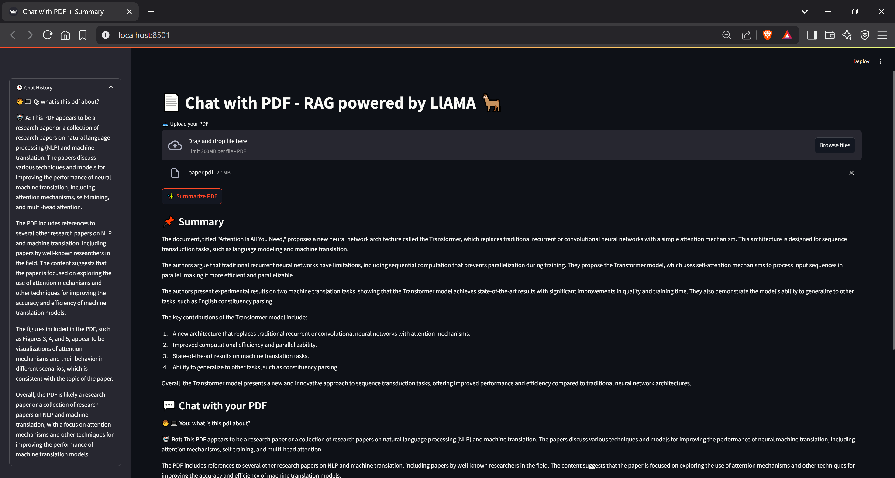

# 📄 Chat with PDF + Summary (RAG powered by LLaMA via Groq)

Interact with your PDF documents by uploading them and chatting naturally!  
This app uses Retrieval-Augmented Generation (RAG) with embeddings and Groq's LLaMA model to answer questions based on your PDF content — plus you can get a summary of the document.

---

## Try It Online

You can try out the PDF Chat RAG app live on Streamlit Cloud:

[🚀 Try the app here](https://pdfchatrag-v56smbd9fcupqcthkboyrd.streamlit.app/)

## 🚀 Features

- Upload and parse PDFs
- Split text into chunks and create semantic embeddings
- Build a FAISS index for fast similarity search
- Query your document in natural language chat
- Generate a concise summary of the PDF
- Store chat history with context retention
- Simple and intuitive UI built with Streamlit

---

## 🛠 Tech Stack

- Python 3.10  
- [Streamlit](https://streamlit.io/) for UI  
- [PyMuPDF (fitz)](https://pymupdf.readthedocs.io/en/latest/) for PDF text extraction  
- [SentenceTransformers](https://www.sbert.net/) for text embeddings  
- [FAISS](https://faiss.ai/) for similarity search  
- Groq’s LLaMA API for chat completions  
- `dotenv` for environment variable management  

---
